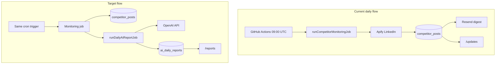

# AI-Generated Daily Reports — Roadmap

## Executive summary

This document describes how to extend **Competitor Directory** with daily AI summaries powered by **OpenAI (ChatGPT)**. After the existing Apify scrape stores new LinkedIn posts in MySQL, a second job sends **only posts not yet included in any report** to OpenAI, persists structured + markdown output, and displays it on a dedicated **`/reports`** page.

**Product decisions (confirmed):**

- **Scope:** New posts only (idempotent via `ai_report_posts` junction table)
- **UI:** Dedicated `/reports` page with archive of past reports
- **Provider:** Direct OpenAI API (`OPENAI_API_KEY`), not Manus Forge `invokeLLM`

---

## Current vs target architecture



---

## Phase 1 — Configuration and OpenAI client

### Environment variables

| Variable | Required | Default | Purpose |
|----------|----------|---------|---------|
| `OPENAI_API_KEY` | Yes (prod) | — | OpenAI authentication |
| `OPENAI_MODEL` | No | `gpt-4o-mini` | Model for reports |
| `OPENAI_MAX_TOKENS` | No | `4096` | Completion cap |
| `AI_REPORT_ENABLED` | No | `true` | Set `false` to skip AI step |

Add to Railway via `setup-railway-env.sh` or dashboard.

### Files

- `server/_core/env.ts` — read env vars
- `server/services/openaiService.ts` — `generateCompetitorReport()`
- `server/prompts/dailyReport.ts` — system prompt + JSON schema instructions

Uses official `openai` npm package. Does **not** use `server/_core/llm.ts` (Forge/Gemini).

---

## Phase 2 — Database schema

### Table: `ai_daily_reports`

| Column | Type | Purpose |
|--------|------|---------|
| `id` | int PK | Report ID |
| `reportDate` | date | Calendar day (UTC) |
| `status` | enum | `pending`, `generating`, `success`, `failed`, `skipped` |
| `postCount` | int | Posts summarized |
| `summaryMarkdown` | text | Human-readable report |
| `summaryJson` | text | Structured JSON for UI |
| `model` | varchar | e.g. `gpt-4o-mini` |
| `promptTokens` | int | Usage tracking |
| `completionTokens` | int | Usage tracking |
| `error` | text | Failure message |
| `generatedAt` | timestamp | When OpenAI finished |
| `createdAt` | timestamp | Row created |

### Table: `ai_report_posts`

| Column | Type | Purpose |
|--------|------|---------|
| `id` | int PK | Junction row ID |
| `reportId` | int | FK → `ai_daily_reports.id` |
| `postId` | int | FK → `competitor_posts.id` |

Unique on `(reportId, postId)`. Posts linked after a **successful** report are never re-sent to OpenAI.

### Migration

- Drizzle: `drizzle/schema.ts`
- SQL: `drizzle/0003_ai_daily_reports.sql`
- Startup: inline migration in `server/db.ts` `runMigrations()`

### DB helpers (`server/db.ts`)

- `getPostsNotInAnyReport(limit?)` — posts with no junction row
- `createAiReport`, `updateAiReport`
- `linkReportPosts(reportId, postIds[])`
- `getAiReports(limit, offset)`, `getAiReportById`, `getLatestAiReport`
- `getPostsByReportId(reportId)`

---

## Phase 3 — Report generation service

**File:** `server/services/aiReportService.ts`

**Function:** `runDailyAiReportJob()`

1. If `AI_REPORT_ENABLED=false` or no API key → log and return
2. Fetch up to 50 posts via `getPostsNotInAnyReport(50)`
3. If zero posts → create `skipped` report for today (or skip duplicate day)
4. Create report row `status: generating`
5. Resolve company/person names from `companies` + `people`
6. Build prompt payload (truncate content to ~500 chars per post)
7. Call `openaiService.generateCompetitorReport()`
8. Save `summaryMarkdown`, `summaryJson`, tokens, `status: success`
9. Insert `ai_report_posts` for all included IDs
10. On failure → `status: failed`, log to `task_logs` as `daily-ai-report`

### OpenAI output contract (JSON)

```json
{
  "executiveSummary": ["bullet 1", "bullet 2"],
  "highlights": [
    {
      "entityName": "Glean",
      "entityType": "company",
      "summary": "Announced ...",
      "postUrls": ["https://..."]
    }
  ],
  "themes": ["AI agents", "Enterprise GTM"],
  "worthWatching": ["Company X hiring push"],
  "lowSignalDay": false,
  "summaryMarkdown": "# Daily Report\n\n..."
}
```

### Prompt rules

- Role: competitive intelligence analyst for AI/GTM companies
- Only facts from provided posts; cite URLs
- Mark low-signal days when content is thin
- No hallucinated announcements or metrics

---

## Phase 4 — Cron integration

**File:** `server/handlers/scheduledCompetitorMonitoring.ts`

After `runCompetitorMonitoringJob()`:

```ts
try {
  await runDailyAiReportJob();
} catch (err) {
  console.error("[Scheduled Handler] AI report failed:", err);
  // Do not fail the HTTP response — scrape already succeeded
}
```

Same daily trigger (09:00 UTC): GitHub Actions → `POST /api/scheduled/competitor-monitoring`.

---

## Phase 5 — tRPC API

**Namespace:** `reports` in `server/routers.ts`

| Procedure | Access | Behavior |
|-----------|--------|----------|
| `list` | protected | Paginated reports, newest first |
| `getById` | protected | Report + linked posts |
| `getLatest` | protected | Most recent `success` or `skipped` report |
| `runNow` | admin | Manual `runDailyAiReportJob()` |

---

## Phase 6 — Frontend `/reports`

**Files:**

- `client/src/pages/Reports.tsx`
- `client/src/App.tsx` — route `/reports`
- `client/src/components/Sidebar.tsx` — nav item "Reports"

**UI sections:**

1. Latest report hero (date, executive summary, post count)
2. Highlight cards from `summaryJson.highlights`
3. Theme chips + "worth watching"
4. Source posts list with links to `postUrl`
5. Archive sidebar/list for previous reports
6. Empty/skipped states
7. Admin "Generate report" → `reports.runNow`

Auth: protected (same as `/updates`).

---

## Phase 7 — Email enhancement (optional, v2)

Prepend AI executive summary to `sendDailyDigestEmail` or link to `/reports`.

---

## Phase 8 — Testing and observability

### Tests (`server/services/aiReportService.test.ts`)

- Zero new posts → `skipped` report
- Mock OpenAI → success + junction rows
- Idempotency: posts already linked are excluded

### Task logs

`taskName: daily-ai-report` with `postsFound` = post count, optional error text.

### Cost controls

- Default `gpt-4o-mini`
- Max 50 posts per run
- ~500 char truncation per post body
- `AI_REPORT_ENABLED=false` in local dev without key

---

## Implementation checklist

| Step | Task | Status |
|------|------|--------|
| 1 | `AI-generated-report.md` (this file) | Done |
| 2 | Schema + migrations + db helpers | Done |
| 3 | `openaiService` + `aiReportService` | Done |
| 4 | Cron handler integration | Done |
| 5 | tRPC `reports.*` | Done |
| 6 | `/reports` UI | Done |
| 7 | Tests + Railway env docs | Done |
| 8 | Email AI snippet | Deferred (v2) |

---

## Files touched

| Action | Path |
|--------|------|
| Create | `AI-generated-report.md` |
| Create | `server/services/openaiService.ts` |
| Create | `server/services/aiReportService.ts` |
| Create | `server/prompts/dailyReport.ts` |
| Create | `client/src/pages/Reports.tsx` |
| Create | `drizzle/0003_ai_daily_reports.sql` |
| Create | `server/services/aiReportService.test.ts` |
| Modify | `drizzle/schema.ts`, `server/db.ts`, `server/_core/env.ts` |
| Modify | `server/handlers/scheduledCompetitorMonitoring.ts` |
| Modify | `server/routers.ts`, `client/src/App.tsx`, `client/src/components/Sidebar.tsx` |
| Modify | `package.json`, `setup-railway-env.sh`, `SYSTEM_GUIDE.md` |

---

## Out of scope (v1)

- 7-day rolling re-summarization
- Twitter ingestion
- Public/unauthenticated reports
- Streaming ChatGPT chat UI
